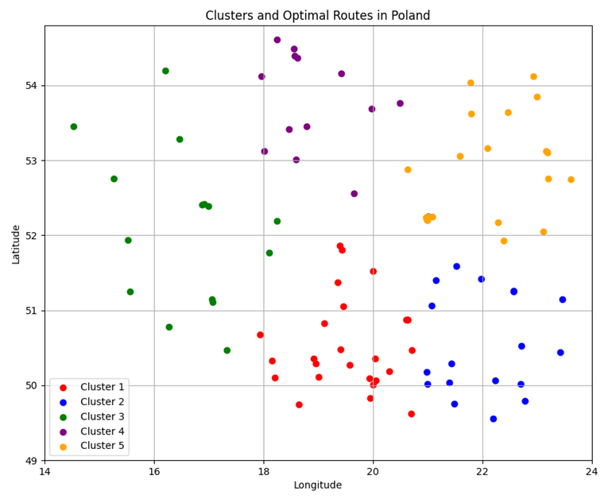
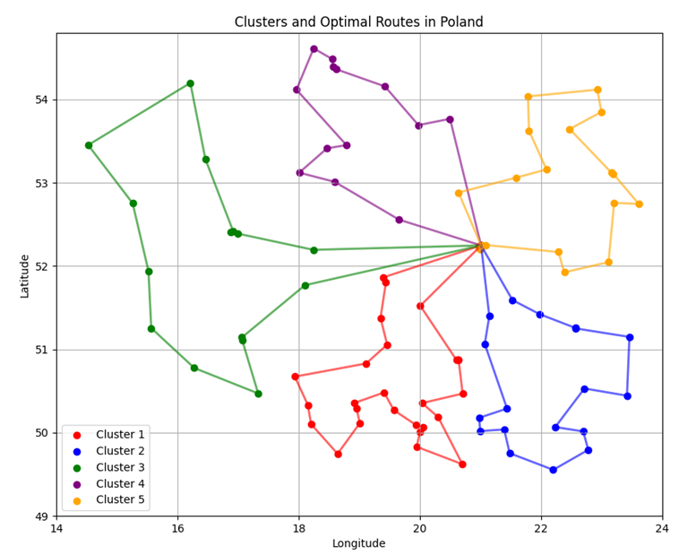
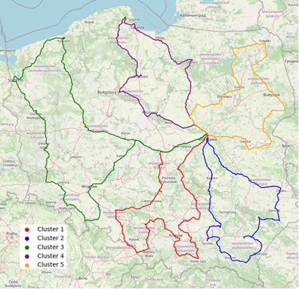

# Cluster Route Planner

## Overview
This project optimizes routes for visiting infectious disease hospitals in Poland. It divides hospitals into 5 clusters and finds optimal routes for each cluster, minimizing the total travel distance for inspections. All routes start and end at the Ministry of Health in Warsaw.

## Features
- Geocoding hospital addresses to coordinates
- Calculating road distances between locations using OSRM API
- Dividing hospitals into optimally positioned clusters using K-means algorithm
- Solving the Traveling Salesman Problem for each cluster
- Visualizing clusters and optimal routes on maps

## Project Structure
- `get_cords.py` - Geocodes addresses and calculates distances between hospitals
- `main.py` - Implements clustering and route optimization
- `utils.py` - Contains shared utility functions

## Data Preparation
The program geocodes hospital addresses from Excel to obtain coordinates:

## Distance Calculation
Road distances are calculated using the OSRM API to ensure realistic travel estimates:

## Clustering
Hospitals are divided into 5 clusters (one for each vice-minister) using K-means algorithm:

<!-- Insert clusters visualization here -->

## Route Optimization
For each cluster, a near-optimal route is calculated using simulated annealing to solve the TSP. Simulated annealing is a probabilistic technique that provides good approximate solutions to the traveling salesman problem:

<!-- Insert optimal routes visualization here -->

## Results
The program outputs:
- Total distance for each route
- Total combined distance for all routes
- Visualization of optimized clusters and routes

<!-- Insert final solution visualization here -->

## Requirements
- Python 3.7+
- pandas, matplotlib, numpy, sklearn, geopy, requests, python_tsp, folium

## Usage
1. Run `get_cords.py` first to generate coordinate and distance data
2. Run `main.py` to perform clustering and route optimization
3. View generated visualizations and distance calculations
